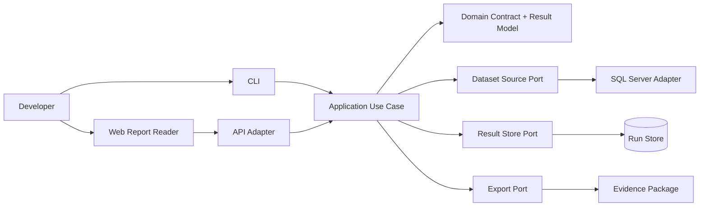

# Architecture Overview

The system is organized around a stable comparison result contract.

## Hexagonal center

The domain owns:

- dataset references
- schema profiles
- comparison contracts
- comparison results
- schema projection rules
- result classification rules

The domain does not own:

- SQL Server connection handling
- SSRS/RDL generation
- PDF rendering
- XLSX formatting
- HTTP request handling
- frontend state

## Application use cases

- inspect schema
- run comparison
- load comparison run
- export evidence package

## Primary adapters

- REST API
- CLI
- web report reader

## Secondary adapters

- SQL Server dataset source
- local file dataset source
- result store
- HTML exporter
- XLSX exporter
- PDF exporter

## Runtime flow

